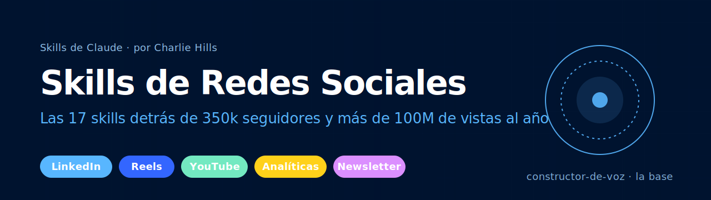

<p align="center">
  
</p>

# Skills de Redes Sociales para agentes de IA

El conjunto completo de skills de Claude detrás del sistema de contenido de Charlie Hills. Más de 350k seguidores en LinkedIn, Instagram, Substack, X y YouTube. Más de 100m de visualizaciones al año. Todo funcionando a través de un solo sistema que comienza con el newsletter y fluye hacia todos los demás canales.

Creado por [Charlie Hills](https://charliehills.substack.com). Suscríbete al [newsletter MarTech AI](https://charliehills.substack.com) para recibir análisis semanales de cómo funciona este sistema en la práctica.

**Las contribuciones son bienvenidas.** ¿Encontraste una forma de mejorar una skill? [Abre un PR](https://github.com/charlie947/social-media-skills/pulls). ¿Te topaste con un problema? [Abre un issue](https://github.com/charlie947/social-media-skills/issues).

## ¿Qué son las Skills?

Las skills son archivos markdown que les dan a los agentes de IA conocimiento y flujos de trabajo especializados para tareas específicas. Cuando las instalas en tu proyecto, Claude reconoce cuándo estás trabajando en una tarea de redes sociales y aplica los patrones, las reglas de voz y las restricciones de plataforma correctas.

## Cómo trabajan juntas las Skills

Cada skill lee un contexto compartido. La skill `constructor-de-voz` es la base. Todas las demás skills la consultan primero (a través de `about-me.md` y `voice.md`) antes de redactar una sola línea.

```
   constructor-de-voz   (about-me.md + voice.md)
            │   la base que leen todas las demás skills
            ▼
   voz-de-newsletter   (voz-de-newsletter.md)
            │   la fuente de la que sale cada pieza de contenido
            ▼
   ┌─ Perfil ............. optimizador-de-perfil
   │
   ├─ Posts de LinkedIn .. redactor-de-publicaciones · disenador-grafico ·
   │                       formateador-de-publicaciones · generador-de-ganchos ·
   │                       matriz-de-contenido · investigacion-de-nicho ·
   │                       infografia-gemini · carrusel-gemini · publicacion-con-cita
   │
   ├─ Video .............. guiones-de-reels
   │
   ├─ YouTube ............ miniatura-de-youtube
   │
   ├─ Analíticas ........ evaluador-de-publicaciones · panel-de-analiticas
   │
   └─ Comunidad ......... comentario-fijado
```

Consulta el `SKILL.md` de cada skill para ver las frases de activación, los inputs y las dependencias.

## Skills disponibles

<!-- SKILLS:START -->
| Skill | Descripción |
|---|---|
| [constructor-de-voz](skills/constructor-de-voz/) | Construye `about-me.md` y `voice.md` a partir de una entrevista más 3 a 5 muestras de escritura. La base que leen todas las demás skills. |
| [voz-de-newsletter](skills/voz-de-newsletter/) | Agrega instrucciones de escritura específicas para el newsletter sobre constructor-de-voz. Produce `voz-de-newsletter.md`. |
| [optimizador-de-perfil](skills/optimizador-de-perfil/) | Reconstruye un perfil de LinkedIn para conversiones. Titular, acerca de, experiencia, sección destacada, más 4 prompts de generación de imágenes. |
| [redactor-de-publicaciones](skills/redactor-de-publicaciones/) | Redacta publicaciones de LinkedIn en tu voz usando los archivos de voz. |
| [disenador-grafico](skills/disenador-grafico/) | Elige entre un gráfico HTML/CSS y una infografía generada con IA según el contenido de la publicación. |
| [evaluador-de-publicaciones](skills/evaluador-de-publicaciones/) | Obtiene tu historial de publicaciones a través de Apify y evalúa cualquier borrador frente a lo que realmente te funciona. |
| [guiones-de-reels](skills/guiones-de-reels/) | Realiza ingeniería inversa de un Reel destacado (outlier) con Apify + Gemini 2.5 Flash. Escribe un nuevo guion en tu voz a partir de tu newsletter. |
| [miniatura-de-youtube](skills/miniatura-de-youtube/) | Convierte el título de un video en un prompt de miniatura de YouTube con tu marca para Gemini. |
| [comentario-fijado](skills/comentario-fijado/) | Comentarios fijados estilo meme con un prompt de generación de imagen a juego. |
| [generador-de-ganchos](skills/generador-de-ganchos/) | 6 variaciones de gancho de dos líneas estilo clickbait por tema. |
| [formateador-de-publicaciones](skills/formateador-de-publicaciones/) | De un tema a una publicación lista para publicar usando PAS, AIDA, BAB, STAR o SLAY. |
| [matriz-de-contenido](skills/matriz-de-contenido/) | Combina tus pilares con 8 formatos para obtener más de 32 ideas de publicaciones en una sola tabla. Estilo Justin Welsh. |
| [investigacion-de-nicho](skills/investigacion-de-nicho/) | Dirige a Claude for Chrome para recorrer Reddit, X y Google con fechas verificadas. Saca a la luz las 20 historias más relevantes de tu nicho de los últimos 7 días. |
| [infografia-gemini](skills/infografia-gemini/) | El estilo pizarra que logró 480k impresiones con 3 publicaciones. |
| [carrusel-gemini](skills/carrusel-gemini/) | Generador de carrusel diapositiva por diapositiva con una etapa de aprobación. |
| [publicacion-con-cita](skills/publicacion-con-cita/) | Claude escribe la cita, Gemini recrea la imagen con la cita integrada. |
| [panel-de-analiticas](skills/panel-de-analiticas/) | De una exportación de LinkedIn Analytics a un dashboard interactivo de React más 5 recomendaciones respaldadas por datos. |
<!-- SKILLS:END -->

## Instalación

### Opción 1: Marketplace de plugins de Claude Code

```bash
# Agrega el marketplace
/plugin marketplace add charlie947/social-media-skills

# Instala el plugin
/plugin install social-media-skills
```

### Opción 2: Clonar y copiar

```bash
git clone https://github.com/charlie947/social-media-skills.git
cp -r social-media-skills/skills/* ~/.claude/skills/
```

### Opción 3: Subir una skill individual (Claude Desktop)

Descarga cualquier carpeta de skill, comprímela en un zip y súbela a través de Customise skills en Claude.

```bash
cd social-media-skills/skills
zip -r constructor-de-voz.skill constructor-de-voz
# Sube constructor-de-voz.skill a través de Customise skills en la app de Claude
```

### Opción 4: Submódulo de Git

```bash
git submodule add https://github.com/charlie947/social-media-skills.git .agents/social-media-skills
```

Luego referencia las skills desde `.agents/social-media-skills/skills/`.

### Opción 5: Hacer fork y personalizar

Haz un fork del repo, reemplaza las reglas de voz por las tuyas y clona tu fork en tus proyectos.

## Uso

Ejecuta `constructor-de-voz` primero. Todas las demás skills necesitan `about-me.md` y `voice.md` para funcionar correctamente.

Una vez instaladas, pídele a Claude que te ayude con tareas de contenido y elegirá la skill correcta:

```
"Construye mi voz" → constructor-de-voz
"Escríbeme una publicación sobre agentes de IA" → redactor-de-publicaciones
"Evalúa este borrador frente a mi historial" → evaluador-de-publicaciones
"Hazme un carrusel a partir de esto" → carrusel-gemini
"Qué debería publicar esta semana" → investigacion-de-nicho o matriz-de-contenido
"Convierte este Reel destacado en un guion" → guiones-de-reels
"Necesito una miniatura para 'Cómo despedí a mi equipo'" → miniatura-de-youtube
"Escríbeme un comentario fijado" → comentario-fijado
```

## Categorías de Skills

### Base de voz
- `constructor-de-voz` — entrevista + análisis de muestras, escribe about-me.md y voice.md
- `voz-de-newsletter` — reglas de escritura específicas para el newsletter sobre constructor-de-voz

### LinkedIn
- `optimizador-de-perfil` — reconstrucción completa del perfil
- `redactor-de-publicaciones` — borradores en tu voz
- `disenador-grafico` — gráfico HTML/CSS o infografía con IA, seleccionado automáticamente
- `formateador-de-publicaciones` — de un tema a una publicación mediante un framework con nombre (PAS, AIDA, BAB, STAR, SLAY)
- `generador-de-ganchos` — 6 variaciones de gancho por tema
- `evaluador-de-publicaciones` — evalúa borradores frente a tu historial de publicaciones
- `matriz-de-contenido` — ideación de pilares x formatos
- `investigacion-de-nicho` — investigación de nicho de 7 días a través de Claude for Chrome
- `infografia-gemini` — estilo pizarra para Gemini
- `carrusel-gemini` — carrusel diapositiva por diapositiva
- `publicacion-con-cita` — flujo de trabajo de cita en dos pasos

### Instagram Reels
- `guiones-de-reels` — análisis de referencia con Apify + Gemini 2.5 Flash, guion alineado con el newsletter

### YouTube
- `miniatura-de-youtube` — de un título a un prompt de miniatura para Gemini

### Comunidad
- `comentario-fijado` — fijado estilo meme + prompt de imagen

### Analíticas
- `panel-de-analiticas` — de una exportación de LinkedIn a un dashboard + 5 recomendaciones

## Requisitos previos

Algunas skills necesitan servicios externos. Configura estas variables de entorno antes de usarlas:

| Variable | Necesaria para |
|---|---|
| `APIFY_API_TOKEN` | evaluador-de-publicaciones, guiones-de-reels |
| `GOOGLE_AI_API_KEY` | guiones-de-reels (análisis de video con Gemini 2.5 Flash) |

Configúralas con:

```bash
export APIFY_API_TOKEN=your_token
export GOOGLE_AI_API_KEY=your_key
```

Las skills de generación de imágenes (`infografia-gemini`, `carrusel-gemini`, `publicacion-con-cita`, `miniatura-de-youtube`, `optimizador-de-perfil`) generan prompts listos para pegar. Los ejecutas en un chat de Gemini aparte con Create Image habilitado. No se necesita ninguna API key.

## Contribuir

Los PRs e issues son bienvenidos. Consulta [CONTRIBUTING.md](CONTRIBUTING.md) para conocer las pautas sobre cómo agregar o mejorar skills.

Ejecuta `./validate-skills.sh` antes de enviar para verificar tu skill frente a la especificación.

## Licencia

[MIT](LICENSE). Úsalas como quieras. Si te ayudan, se agradece un enlace de vuelta al [newsletter](https://charliehills.substack.com).

— Charlie
